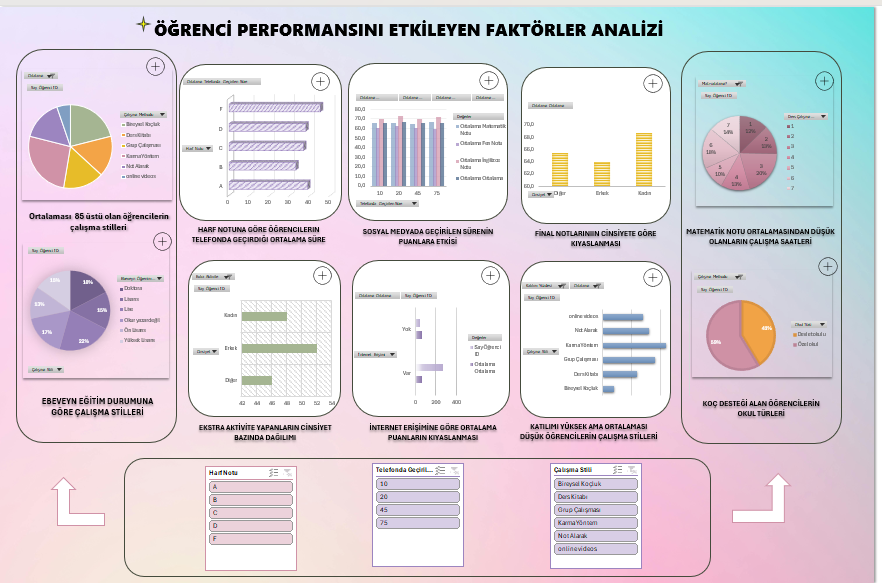
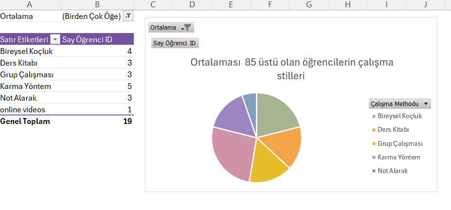
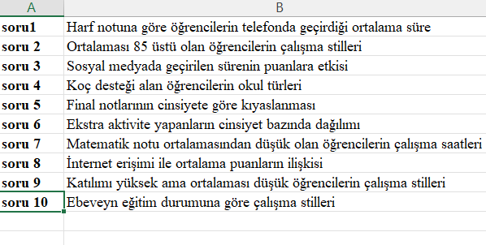
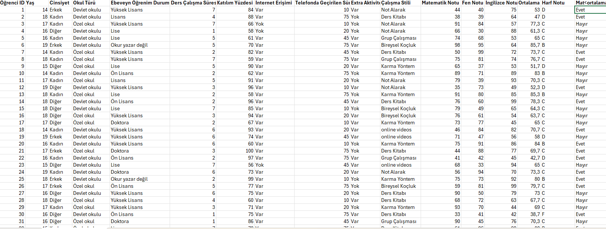

# 📊 Student Performance Analysis Dashboard

<p align="center">

</p>

<p align="center">
An interactive Microsoft Excel dashboard developed to analyze student performance using data visualization, Pivot Tables, Pivot Charts and KPI indicators.
</p>

---

# 📖 Project Overview

The **Student Performance Analysis Dashboard** is an Excel-based data analytics project that transforms raw educational data into meaningful visual insights.

The dashboard enables users to explore student performance through interactive charts, Pivot Tables and KPI indicators, making it easier to identify trends and compare different educational factors.

---

# 🎯 Project Objectives

* Analyze student performance using visual analytics.
* Identify relationships between educational factors.
* Present insights through interactive dashboards.
* Improve decision-making with data visualization.
* Demonstrate practical Excel dashboard development skills.

---

# 🖥 Dashboard Preview

<p align="center">

</p>

The dashboard provides a complete overview of student performance using interactive charts and KPI cards.

---

# 📊 Pivot Table Example

<p align="center">

</p>

Pivot Tables are used to summarize educational data and generate dynamic dashboard visualizations.

---

# ❓ Analysis Questions

<p align="center">

</p>

The dashboard is designed to answer analytical questions such as:

* Average phone usage according to letter grades
* Study methods of high-performing students
* Impact of social media usage on academic success
* School types of students receiving coaching support
* Grade comparison by gender
* Extracurricular activity distribution
* Study habits of students with low mathematics scores
* Internet access and academic performance
* Study styles based on attendance
* Parent education level and study methods

---

# 📋 Data Structure

<p align="center">

</p>

The dashboard analyzes structured educational data including student demographics, attendance, study habits, examination scores and academic performance indicators.

---

# ✨ Features

* 📊 Interactive Dashboard
* 📈 KPI Cards
* 📉 Pivot Charts
* 📑 Pivot Tables
* 🎛 Interactive Slicers
* 📚 Educational Data Analysis
* 📋 Performance Comparison
* 📊 Dynamic Visualizations

---

# 🛠 Technologies Used

* Microsoft Excel
* Pivot Tables
* Pivot Charts
* Slicers
* Conditional Formatting
* KPI Dashboard
* Data Visualization

---

# 📂 Repository Structure

```text
Student-Performance-Analysis-Dashboard
│
├── README.md
├── Student_Performance_Dashboard.xlsx
├── dashboard.png
├── sorgu.png
├── sorular.png
└── veriseti.png
```

---

# 🚀 Getting Started

1. Download the Excel dashboard.
2. Open it using Microsoft Excel.
3. Enable editing if necessary.
4. Use the interactive slicers and filters.
5. Explore the dashboard to analyze student performance.

---

# 💡 Key Insights

The dashboard helps analyze the relationship between academic performance and various educational factors including:

* Study habits
* Phone usage
* Social media usage
* Attendance
* School type
* Parent education
* Internet access
* Extracurricular activities

---

# 🎓 Skills Demonstrated

* Data Analysis
* Dashboard Design
* Microsoft Excel
* Data Visualization
* KPI Reporting
* Pivot Tables
* Pivot Charts

---

# 👩‍💻 Author

**Rumeysa Yılmaz**

🎓 Management Information Systems Student

📊 Aspiring Data Analyst

💻 Backend Development Enthusiast

🤖 Machine Learning Learner

---

<p align="center">
⭐ If you found this project useful, consider giving it a star.
</p>
